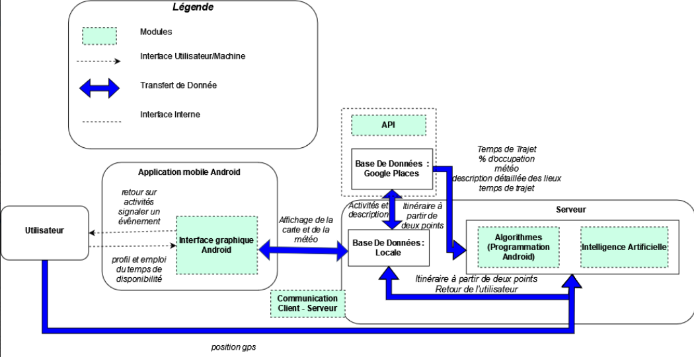

=== Schéma d’architecture

==== Description des blocs
//Il faut ici une description textuelle de chaque bloc, sa fonction
//détaillée. En général, un bloc correspond à un module, sauf exception.
//Il peut être adapté de faire des blocs plus petits qu’un module.
//Il est important ici de distinguer les bibliothèques identifiées et
//disponibles de ce que vous allez produire (coder) vous-même. Vous ne
//devez pas réinventer la roue, mais vous ne devez pas non plus avoir votre
//projet tout fait en encapsulant un programme déjà existant.
Notre application a pour but de proposer des itinéraires touristiques aux utilisateurs. Le diagramme ci-dessus représente l’architecture générale de notre projet. 

Notre application est regroupée en trois blocs principaux. 

*1. Utilisateur :*
La personne désirant avoir un itinéraire touristique. L’utilisateur communique avec l’application Android mobile grâce à l’interface graphique. 

*2. Application mobile Android :* 
Contient le module interface graphique. 

-   Interface graphique

Fournit à l’utilisateur les fonctionnalités avec lesquelles il peut interagir. L’utilisateur utilise l’écran du mobile pour contrôler son exécution. L’interface graphique transmet les requêtes utilisateurs au module communication client-serveur. L'interface graphique recoit du module communication client-serveur plusieurs données comme la carte des lieux touristiques.

*3. Ordinateur :* 
Regroupe les différents modules permettant le bon fonctionnement de notre application.

-   Communication client-serveur

Permet l’échange de données entre l’entité application mobile Android et l’ordinateur.

-   Web sémantique

Nous utiliserons l’API (interface de programmation) Google Places. Celle-ci va nous permettre de récupérer des informations clés pour notre application, notamment la carte et les lieux touristiques.

-   Base de données locale

Permet le stockage les données personnelles des différents utilisateurs. Ce module reçoit aussi des données du module web sémantique.

-   Algorithme

Propose à l'utilsateur un itinéraire en fonction de ses préférences de base. Permet également le calcul du plus court chemin pour les déplacements de l’utilisateur.

-   Intelligence artificielle 

Ce module utilise les préférences de l’utilisateur pour optimiser l’algorithme existant et personnaliser davantage l’itinéraire. Il se basera aussi sur les retours des autres utilisateurs pour avoir un parcours de plus en plus adéquat (apprentissage par renforcement).
