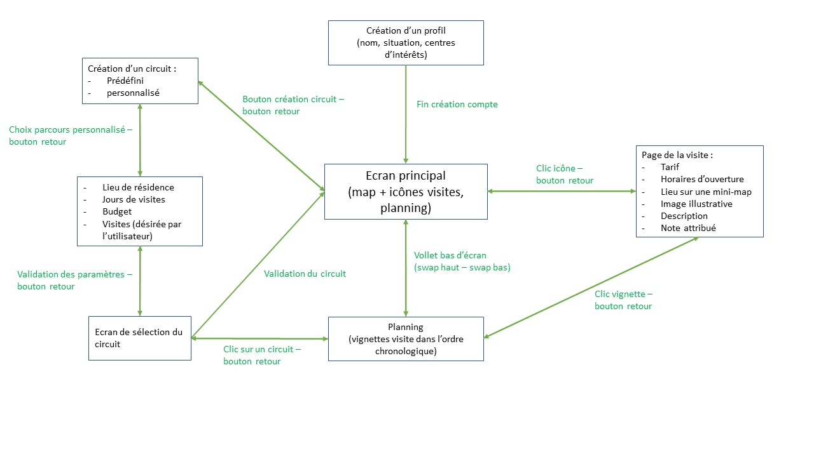

=== Description de la proposition
//*_Note: 2 page max._*

//_Décrire de façon détaillée votre projet : motivations de base/problèmes
//constatés avant élaboration du projet, comment votre projet répond à ces
//besoins. Ajouter une image ou une figure pour montrer à quoi cela
//ressemble si besoin._

*Motivations :* Notre but est de développer une application permettant à un touriste de profiter de parcours de visites dans Paris adaptés à ses préférences. L’objectif est double : faciliter la visite de Paris en proposant des circuits de visites adaptés à l’utilisateur, et réduire l’affluence des lieux touristiques aux horaires de sur-fréquentation.

*Problèmes rencontrés lors de l’élaboration du projet :* Il est à noter que ce projet n’est pas le premier auquel nous avons pensé. Nous désirions auparavant réaliser une application sur téléphone accompagnée d’un caddie motorisé pourvu d’un support pour poser un téléphone. A partir d’une liste de course entrée préalablement sur l’application, cette dernière aurait proposé le plus court chemin dans le magasin pour récupérer tous les articles sur la liste à la manière d’un GPS posé sur le caddie. Bien que tous désireux de réaliser ce projet, trop de contraintes nous ont poussés à l’abandonner : la réalisation d’une motorisation, le repérage précis du téléphone dans le magasin, la localisation des articles…

*Problèmes constatés avant l’élaboration du projet :* Nous avons cartographié la liste des problèmes à résoudre pour atteindre notre but :

-	Bases de données : il nous faut

	Connaître toutes les activités que Paris a à nous offrir, y compris les moins connues ;

	Savoir l’affluence en temps réel des sites, mais aussi une prévision en fonction de la date et de l’horaire de la journée ;

	Renseigner les tarifs de chaque visite ainsi que les horaires d’ouverture ;

	Pourvoir une description sommaire de chaque lieu.

-	Achat de tickets : une fois le circuit proposé, il est nécessaire que l’utilisateur réserve ses billets pour éviter de se retrouver dans des files d’attentes. Il faut donc prévoir l’achat de

	Tickets virtuels pour les visites ;
	Titres de transports virtuels.

-	Personnalisation des parcours : il faut pouvoir accumuler des données sur chaque utilisateur afin de pouvoir proposer un circuit de visite au plus proche de ses attentes.

-	Parcours prédéfinis : un touriste lambda est souvent désireux d’être complètement guidé dans ses premières visites avant même toute personnalisation.

-	Estimation des temps : pour pouvoir proposer un circuit cohérent, il est crucial d’évaluer le temps à passer dans chaque visite et dans les transports.

-	Budget : le budget n’étant pas infini et chaque visite, ou bien déplacement, ayant un prix, il nous faut connaître le budget alloué au parcours pour ne pas proposer des circuits trop onéreux.

-	Planification horaire : il est nécessaire de savoir quels jours et à quelles périodes de la journée notre utilisateur souhaite consacrer son temps aux visites.

-	Choix du circuit : Comment être sûr que le circuit proposé par l’algorithme réponde aux attentes de l’utilisateur ?

-   Des circuits dynamiques et une intéraction entre les utilisateurs : il faudra être capable d'adapter les circuits en temps réel en fonction des imprévus, de permettre à l'utilisateur de dévier de son chemin si une opportunité intéressante se présente et d'offrir une certaine interaction entre les utilisateurs.  

-	Interface utilisateur : le but étant de rendre l’utilisation de notre application la plus intuitive possible, une bonne interface utilisateur permettant d’accéder librement et facilement aux données proposées (affluence, lieu des visites…) est essentielle.

-   Une application ludique : pour ne pas lasser les utilisateurs et les inciter à utiliser certaines des fonctionnalités, il faudra mettre en place des bonus à but purement ludique.

*Réponse aux besoins soulevés par le projet :*

-	Bases de données : nous utiliserons l’API « Places » de google qui nous donne accès à la base de données de tous les lieux référencés sur Paris (emplacement géographique, description, tarifs, horaires d’ouvertures) ainsi que leur affluence.

-	Achat de tickets : pour chaque visite, nous proposerons un lien redirigeant l’utilisateur vers le lieux de l’achat de tickets sur le site web de la visite. Pour les titres de transports, nous utiliserons la fonctionnalité récemment déployée par la RATP permettant l’achat d’un titre virtuel.

-	Personnalisation des parcours : nous proposerons à chaque utilisateur de créer un compte sur l’application référençant son nom, sa situation (étudiant, enfant…), et ses centres d’intérêt (peinture, gastronomie, histoire…). Ces derniers permettront d’établir un premier portrait des visites susceptibles d’intéresser l’utilisateur. De plus, à l’issu de chaque visite, l’application proposera de noter de 1 à 5 la visite effectuée. A partir des données récupérées sur chaque utilisateur, l’application compare ce qu’a aimé faire l’utilisateur concerné avec d’autres utilisateurs ayant aimé les mêmes visites pour lui proposer des visites appréciées par des utilisateurs aux goûts similaires (apprentissage par renforcement).

-	Parcours prédéfinis : des parcours prédéfinis seront proposés de base dans l’application. Il y aura donc le choix : soit suivre un circuit prédéfini, soit en créer un personnalisé.

-	Estimation des temps : chaque activité se verra attribuer une valuation temporelle : petite(1), moyenne(2), grosse(3). En fonction de la période de la journée, la valuation temporelle totale de toutes les visites ne peut dépasser une certaine limite (ex. : matin < 3, après-midi < 5, soir < 3, nuit < 3). L’utilisateur n’aura qu’à choisir de réaliser toutes les visites suggérées ou non tout en sachant que tout faire est réalisable. Si une activité par exemple matinale n’a pas pu être réalisée, il ne lui sera pas proposé de l’effectuer l’après-midi qui suit sous peine de tomber dans les plus grosses heures d’affluence. A la place, il lui sera proposé une autre date (voire ne pas la faire) qui prendrait soin d’éviter les heures de plus forte affluence.

-	Budget : pour chaque circuit, l’utilisateur sera prié de rentrer dans l’appli le budget qu’il souhaite allouer à son parcours. Ainsi, les parcours proposés seront exclusivement ceux qui ne dépassent pas le budget imposé.

-	Planification horaire : pour chaque circuit (de un ou plusieurs jours), il est nécessaire que l’utilisateur rentre les dates auxquelles il souhaite dédier son temps à faire des visites ainsi que pour chaque jour, les périodes de la journée. En fonction des horaires d’ouverture de chaque visites, le trajet en sera impacté.

-	Choix du circuit : pour la création de chaque nouveau circuit, l’utilisateur a le choix entre un circuit prédéfini et un circuit personnalisé. Si le deuxième est choisi, il est invité à entrer, s’il le désire, les lieux qu’il souhaite visiter au cours de son périple ainsi que son lieu de résidence. A partir des lieux qu’il désire visiter, des données collectées sur son profil, de la météo et de l’affluence des lieux en fonction des différentes dates et heures de la journée, plusieurs circuits seront proposés à l’utilisateur tous partant de son lieu de résidence visant à réaliser chaque visite lors de son moment de plus faible affluence. Il sera alors possible pour lui de sélectionner le trajet à sa convenance. et même de pouvoir changer individuellement chaque visite dans la mesure des visites non surchargées disponible dans les alentours pour le créneau horaire prévu.

-   Des circuits dynamiques et une intéraction entre les utilisateurs : En cas d'imprévus (météo, affluence ...) proposer des alternatives sous forme de notifs. Si l’utilisateur veut absolument visiter le lieu, il le signale, sinon il a plusieurs alternatives autour de lui.
    Lorsqu’il y a des événements éphémères (spectacles de rue, concerts de rue, expositions temporaires) les utilisateurs peuvent créer des événements visibles sur la carte, en postant des photos, des commentaires etc…
    Lorsque l’on voit un regroupement, on envoie une notification aux utilisateurs à proximité en leur proposant de créer un événement. Pour être sûrs qu’un événement créé a lieu / est toujours d’actualité, on demande confirmation aux utilisateurs à proximité à l’aide d’un système de pouce en l’air / en bas.
    Pour être sûrs qu’un événement créé a lieu / est toujours d’actualité, on demande confirmation aux utilisateurs à proximité à l’aide d’un système de pouce en l’air / en bas.

-	Interface utilisateur : l’application dispose d’un « écran principal ». Ce dernier sera composé d’une map centrée sur la localisation de l’utilisateur ainsi que d’icones apparaissant sur la map indiquant tous les lieux dignes d’intérêt à proximité. En cliquant sur l’une de ces icones, l’appli redirige vers la page de la visite. Celle-ci donne la position du lieu sur une mini-map, le tarif, la description de la visite, l'affluence, les horaires d’ouvertures et une image illustrative de la visite (fournis par l’API « places »). L'utilisateur peut aussi y noter la visite. 
A l’aide d’un volet situé en bas de l’écran principal, on accède au planning de la journée et/ou de la semaine. Par défaut, celui-ci est vide. Pour créer un circuit, un bouton placé en haut à droite de l’écran principal redirige vers la sélection « choix du circuit ». Une fois un circuit sélectionné, le volet « planning » présentera des vignettes pour chaque visite placées dans l’ordre chronologique du parcours de la journée. Ces vignettes ne seront qu’une version miniature de la « page de la visite » de chaque visite. En cliquant sur une de ces vignettes, l’utilisateur est d’ailleurs redirigé vers la « page de la visite » correspondante. Enfin, en haut à droite de chaque vignette sera présente ou non une puce indiquant si cette visite est le fruit de l’algorithme ou une visite rentrée par l'utilisateur.

-   Une application ludique : Pour inciter les personnes à jouer le jeu, on mettra en place un système de “points” sur notre profil et des badges débloquables en effectuant certaines actions (par ex : “créer 10 événements”, “prendre 5 photos d’événements éphémères” etc…).
Il y aura la possibilité de débloquer différentes photos de profils, par exemple la tour Eiffel si on y est allé. 

//*_Architecture de l’application :_*

//=== Exemples d'utilisation d'AsciiDoc

//_Ici quelques exemples de syntaxe AsciiDoc pour ajouter des équations, des images, des listes..._

//_Ces exemples *ne doivent pas* être conservés dans la version finale du rapport._

//==== Exemples d'équations

//* Inline math: latexmath:[\int_{-\infty}^\infty g(x) dx]
//Pour ajouter une équation ou un symbole mathématique dans le corps du texte.

//* Block math pour avoir une équation centrée au milieu de la page:

//[latexmath]
//++++
//\int_{-\infty}^\infty g(x) dx
//++++

//==== Exemples d'images

//* Ceci est un exemple d'image:

//image::../images/logo_PACT.png[logo pact]

//* L'image peut être redimensionnée et avoir un titre:

//.Le logo du projet
//image::../images/logo_PACT.png[logo pact, 400, 400]

//* Pour le rapport, les images peuvent être aux formats jpeg, png ou même *svg*:

//image::../images/pact.svg[un autre logo pact,300,300]

//* Les images peuvent aussi être mises dans le corps du texte par exemple image:../images/logo_PACT.png[logo pact, 50,50].

//==== Exemples de code

//On peut ajouter des blocs de code formatés en précisant le langage utilisé:

//[source,python]
//----
//def func(i):
//   x = 3 + i
//   return x

//for i in range(10):
//   print "---> ", func(i)
//----

//[source,java]
//----
//class foo {
//   Integer i;
//   String s;
//}
//----

//==== Exemples de listes

//* AAAA
//** aaaaa
//*** axaxax
//** bbbbb
//** ccccc
//* BBBB
//* CCCC

//'''''

//.  AAAA
//..  aaaa
//..  bbbb
//.  BBBB
//.  CCCC

//'''''

//.Liste des tâches à faire:
//*  [ ] Pas encore fait
//** [ ] étape X
//** [x] étape Y (a démarré en avance)
//** [ ] étape Z
//*  [x] Complètement finit
//** [x] étape Q
//** [x] étape R
//** [x] étape `finale` E=mc^2^

//'''''

//.Liste descriptive:

//Étape 1::: Faire A, B, C…
//Étape 2::: Faire X, Y, Z…
//Étape 3::: Faire W, et c'est fini…

